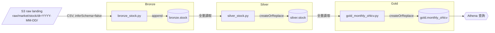

# 6. Runtime View (資料流 / 執行時期視角)

> 本章只呈現「目前實際怎麼跑」的執行流程圖。每一層的設計原則、取捨理由屬於通用架構規則，見 [08. Crosscutting Concepts](08_concepts.md)（Medallion Architecture）與 [ADR-0002](../architecture/adr/0002-medallion-layering.md)／[ADR-0003](../architecture/adr/0003-append-vs-overwrite.md)，本章不重複展開。

## 6.1 批次資料流：Market Data / Stock（Slice0）

| 節點 | 對應程式 / Table | 一句話說明 |
| --- | --- | --- |
| `BJOB` | [`src/transform/bronze_stock.py`](../../src/transform/bronze_stock.py) | 全字串讀取 + provenance 標記，寫入 `bronze.stock` |
| `SJOB` | [`src/transform/silver_stock.py`](../../src/transform/silver_stock.py) | 去重 + 型別 cast + 品質過濾，寫入 `silver.stock` |
| `GJOB` | [`src/transform/gold_monthly_ohlcv.py`](../../src/transform/gold_monthly_ohlcv.py) | 月頻聚合（`min_by`/`max_by`），寫入 `gold.monthly_ohlcv` |

## 6.2 目前執行方式

- Slice0 沒有 Airflow，三個 Glue Job 目前是人工依序觸發（`aws glue start-job-run`），順序固定 Bronze → Silver → Gold，中間沒有自動相依/重試機制。
- 圖中未畫出 partition：Silver（`months(trade_date)`）、Gold（`months(year_month)`）都已宣告月粒度 partition，Bronze 因 `date` 欄位是 string 型別而不宣告 partition，完整理由見 [ADR-0003](../architecture/adr/0003-append-vs-overwrite.md) 與 [08_concepts.md §8.6](08_concepts.md#86-partition-設計)。
- 圖中的 `Athena 查詢` 節點已完成正式驗證（筆數、schema、去重、品質規則、聚合正確性皆通過），對應 [spec §4 item 8](../specs/slice0-batch-market-data.md)，驗證 SQL 見 [docs/runbooks/slice0-verification.md](../runbooks/slice0-verification.md)。
