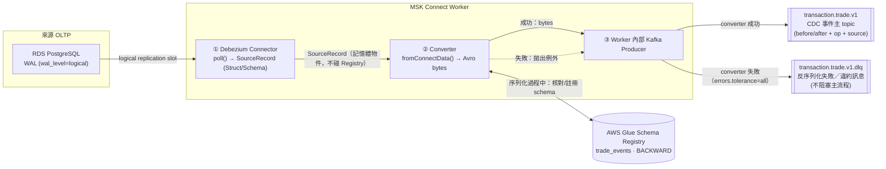

# Kafka Connect：Connector、Converter、Schema Registry 的訊息流時機

> 概念解說筆記，**不是**正式規格或決策紀錄（那些見 [docs/specs/](../specs/)、[docs/architecture/adr/](../architecture/adr/)）。記錄 Slice 2a CDC pipeline 實作討論中釐清的一個常見誤解：Connector 什麼時候把工作交給 Converter、Schema Registry 到底是被誰呼叫的。

## 情境

Slice 2a 的 CDC pipeline：Debezium PostgreSQL Connector 讀 RDS 的 WAL（write-ahead log，資料庫預寫式日誌），組成變更事件，最終要以 Avro 格式寫進 `transaction.trade.v1` 這個 Kafka topic，並用 AWS Glue Schema Registry 做相容性強制。實作對應 [msk_connector.tf](../../infra/environments/dev-slice2/msk_connector.tf)。

## 常見誤解

「Connector 收到一筆 record，會先去問 Schema Registry 這筆合不合規；合規才放行，不合規則擋下。」

這個理解錯在把 Connector 當成會跟 Registry 對話的角色。實際上 **Connector 從頭到尾不知道 Schema Registry 存在**——會跟 Registry 對話的是 Converter，而且「問合不合規」跟「序列化成 bytes」是 Converter 內部**同一個動作**，不是兩個先後步驟。

## 正確的時機順序

1. **Worker 呼叫 Connector 的 `poll()`**（Debezium 實作的方法）→ 回傳一批 `SourceRecord`——純 Java 記憶體物件（`Struct` + `Schema`），這一步不涉及序列化、不涉及 Registry，Connector 只負責「我從來源讀到了什麼」。
2. **Worker 把每筆 `SourceRecord` 交給 Converter 的 `fromConnectData()`**——序列化在這裡發生。對 Avro-aware 的 converter（這裡是 `AWSKafkaAvroConverter`）而言，序列化的實作方式本身就是：把 Connect Schema 轉成 Avro schema → 呼叫 Glue Schema Registry API 查／註冊 → Registry 內部跑 `BACKWARD` 相容性比對 → 相容就回傳 schema ID，converter 把 ID 跟 Avro 編碼內容包成最終 byte[]；不相容就拋例外，converter 產不出 bytes。
3. **Worker 內部的 Kafka producer 送出**——converter 成功產出 bytes 就送進正式 topic；converter 拋出例外，且 `errors.tolerance=all` 設了 DLQ，Worker 攔截例外改送 DLQ。

Converter 出現的時機點固定是「Connector 產出記憶體物件」跟「Producer 真正送出 bytes」中間那個縫隙——這在任何 Kafka Connect connector 上都成立，不限於這個 Avro + Schema Registry 的組合（換成最陽春的 `JsonConverter`，一樣是這個時機跑，只是不會多打一次 Registry API）。

## 流程圖

## 圖裡兩個 topic 方塊在做什麼

| 方塊 | 對應設定 | 內容 |
| --- | --- | --- |
| `transaction.trade.v1` | `msk_connector.tf` 的 `transforms.route.replacement` | 序列化成功的 CDC 事件，Avro 格式，含 before/after 影像與操作類型（`c`/`u`/`d`），下游（Slice 2b）從這裡消費 |
| `transaction.trade.v1.dlq` | `errors.deadletterqueue.topic.name` | Converter 序列化失敗（如違反 `BACKWARD` 相容性規則）或反序列化失敗的訊息去向，附錯誤 context header；「壞訊息不擋住好訊息」，不影響主流程持續寫入 `.v1` |

## 一個常被誤讀的地方：GSR 不會主動送訊息去任何 topic

圖上 GSR（Schema Registry）跟 Converter 之間畫的是雙向箭頭——Registry 只回傳「schema 合不合規」的判定（相容就給 schema ID，不相容就讓呼叫失敗）給 Converter，本身完全不碰 Kafka topic。真正決定送到 `T1` 還是 `DLQ` 的是 Worker 內部的 producer，依據 Converter 有沒有成功產出 bytes 來決定，不是 Registry 直接路由。

## 相關文件

- [docs/specs/slice2a-cdc-ingestion.md](../specs/slice2a-cdc-ingestion.md) §3.4 — `BACKWARD` 相容性模式、違約訊息進 DLQ 的定案
- [infra/environments/dev-slice2/msk_connector.tf](../../infra/environments/dev-slice2/msk_connector.tf) — 本文對應的實際 connector 設定（`value.converter`、`errors.deadletterqueue.*`）
- [kafka-connect-plugin-model-eli5.html](kafka-connect-plugin-model-eli5.html) — Connector／Converter 作為兩種獨立「工人」的圖解比喻，跟本篇是同一組概念的互補視角（一篇講「這兩個角色是什麼」，本篇講「訊息什麼時候經過誰」）
